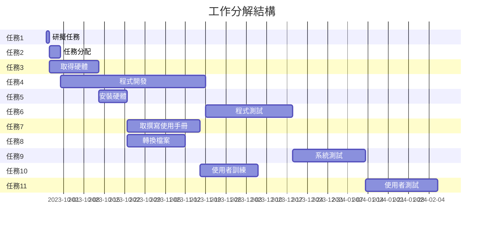
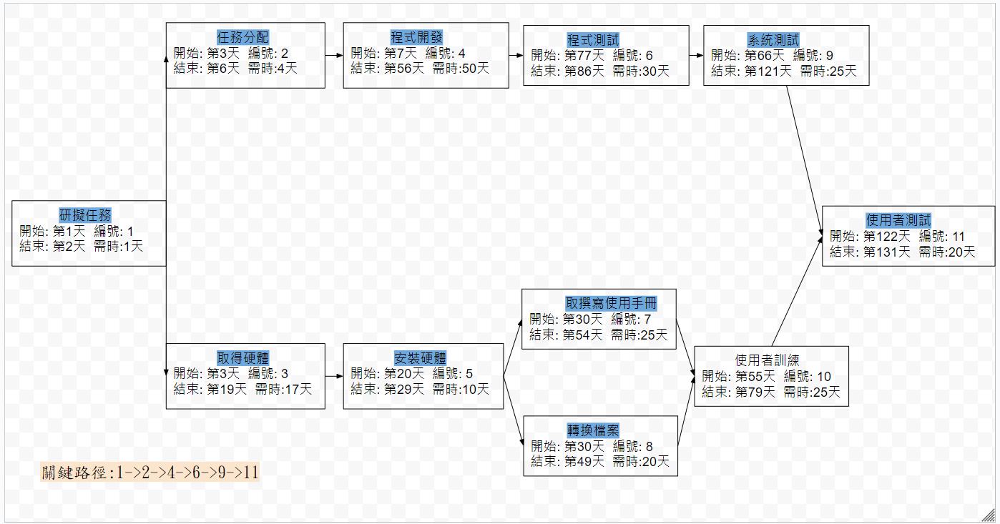

| 任務 | 說明 | 參與人員 |
|:-------:|:-------:|:------:|
| 1 | 研擬計畫| All |
| 2 | 任務分配 | All |
| 3 | 資料蒐集 | All |
| 4 | 建置資料庫 | All |
| 5 | 前端開發 | All |
| 6 | 後端開發 | All |
| 7 | 程式測試 | All |
| 8 | 撰寫使用者手冊 | All |
| 9 | 使用者訓練 | All |
| 10 | 使用者測試| All |

# 甘特圖
### Mermaid

# PERT 圖

# 關鍵路徑
關鍵路徑:1->2->4->6->9->11

